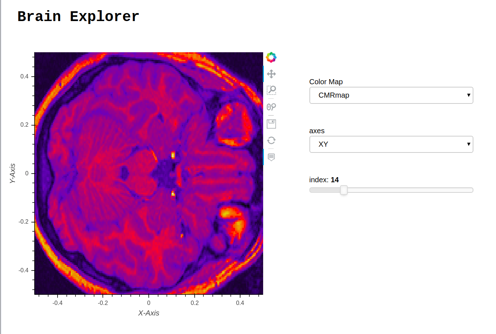

# Brain-Explorer

This notebook shows 3D visualization of Brain.



## Installation

1. git clone https://github.com/hdsingh/Brain-Explorer

2. cd Brain-Explorer

3. `conda env create -f environment.yml`  or 
    ```
    conda create env -n brain_env
    conda activate brain_env
    conda install -c pyviz/label/dev -c bokeh/label/dev bokeh datashader holoviews  hvplot param panel
    ```

## Deployment

Deploy this dashboard from the CLI using:

 $ panel serve app.ipynb